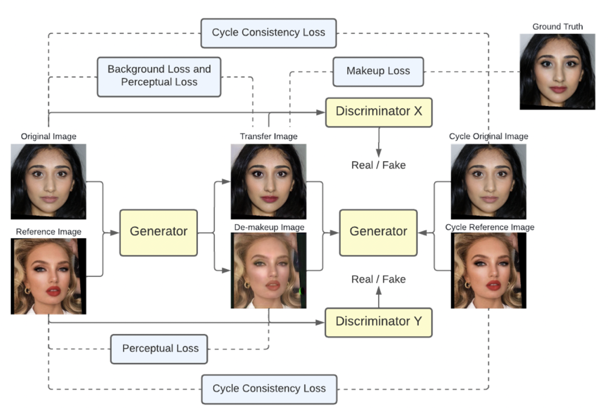
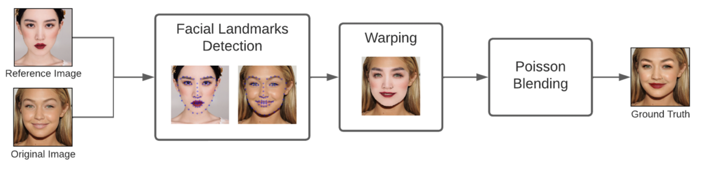
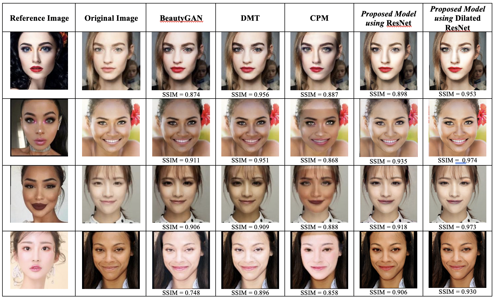

# Generative Adversarial Network (GAN) Based Makeup Transfer System for Various Skin Tone 💄

## Introduction
Facial makeup transfer system is capable of transferring makeup styles from a reference face image to another face that has not used makeup. Unfortunately, some applications of the makeup transfer system that have now been published can only be used optimally for fair-skinned faces. Thus, this research addresses this issue by developing a facial makeup transfer system that can be use by users with various skin colors, using one of the latest deep learning applications, namely generative adversarial network (GAN). 

_Model Framework_

In this study, several adjustments were made to a GAN-based makeup transfer model namely [BeautyGAN](https://dl.acm.org/doi/10.1145/3240508.3240618), and the important components of GAN such as ground truth, loss function, and model architecture were adjusted to be able to produce good results for various skin tones. Experiments were made by pairing two types of model architecture: ResNet and Dilated ResNet for the generator model. Then, changes to ground truth were made using warping and Poisson blending methods (seamless clone) to obtain desired result. 

_Ground Truth Making_

## Results

## Training
1. Go to `experiment` folder
2. Run `python convert.py` to convert dataset so the format will be able to be trained by model
3. Modify train.py and start training.  
    `python train.py` 
4. Run `python export.py` and you will get h5 model in `..\export_models`

## Demo
1. Go to `experiment` folder
2. Modify the directories for original images, reference images, and resulting images in `demo.py`.
3. Run `python demo.py`, you will find the transfer result according the directory that you desired.

## Coding References
1. Data Pre-processing
- [Scrape images from Pinterest](https://github.com/civiliangame/PinterestScraper)
- [Face Alignment](https://github.com/serengil/tensorflow-101/blob/master/python/face-alignment.py)
2. Ground-truth making
- [Face Swapping with Seamless Clone](https://pysource.com/2019/05/28/face-swapping-explained-in-8-steps-opencv-with-python/)
3. [Machine learning model](https://github.com/yan86471/DMT-implementation)